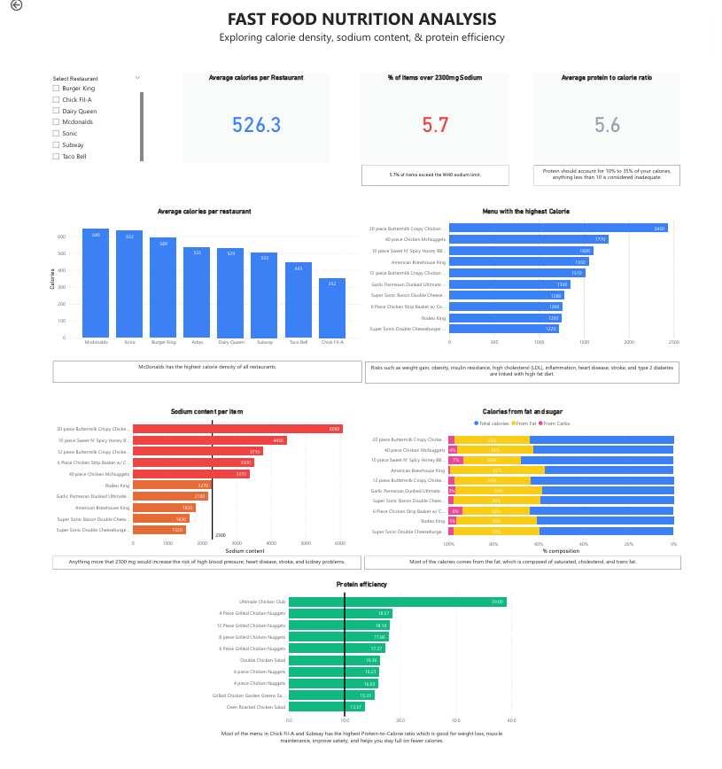

# Fast Food Nutrition Analysis

**Executive Summary:**  
This project explores the nutrition content of major US fast-food chains, focusing on calories, sodium, and protein efficiency. Results show that many menu items go far beyond daily recommended limits, while only a few grilled or salad options stand out as healthier choices. Overall, the analysis highlights the nutritional risks of fast food and points to better alternatives within the menus.  

Data from [Kaggle](https://www.kaggle.com/datasets/ulrikthygepedersen/fastfood-nutrition/data).

---

## Project Overview
The goal is to uncover the nutritional risks of popular fast-food meals and highlight which menu items are calorie-dense, sodium-heavy, or protein-efficient.

### Key Questions
1. Which fast-food chains have the most calorie-dense menus and do these pose an obesity risk?  
2. Which menu items exceed recommended daily sodium intake in a single meal?  
3. Which items provide the best protein-to-calorie ratio?

---

## Tools and Libraries
- **Python (Pandas, Numpy)** - data cleaning and wrangling
- **Power BI** - visualization and analysis

---

## Results

### Calorie-Dense Menus

McDonald’s has the highest average-calorie menu of 640 kcal and Sonic takes the 2nd spot with an average-calorie menu of 632 kcal.

<b>McDonald's menu (items >1,500 kcal)</b>

- 20-piece Buttermilk Crispy Chicken Tenders (2,430 kcal)  
- 40-piece Chicken McNuggets (1,770 kcal)  
- 10-piece Sweet N' Spicy Honey BBQ Glazed Tenders (1,600 kcal)  
- 12-piece Buttermilk Crispy Chicken Tenders (1,510 kcal)  

<b>Burger King's menu (items >1,500 kcal)</b>

- American Brewhouse King (1,550 kcal)  

Fast-food items tend to be high in calories, fats, and sodium while low in nutrients. They are served in large portions and often paired with sugary drinks (not included in this analysis), which further increases calorie intake.

---

### Sodium Overload

The American Heart Association recommends no more than 2,300 mg of sodium per day with an optimal goal of no more than 1,500 mg of sodium per day.

<b>McDonald's menu (items >2,300 mg sodium)</b>

- 20-piece Buttermilk Crispy Chicken Tenders (6,080 mg)  
- 10-piece Sweet N' Spicy Honey BBQ Glazed Tenders (4,450 mg)  
- 12-piece Buttermilk Crispy Chicken Tenders (3,370 mg)  
- 40-piece Chicken McNuggets (3,370 mg)  

<b>Dairy Queen's menu (items >2,300 mg sodium)</b>

- 6-Piece Chicken Strip Basket w/ Country Gravy (3,500 mg)  

These menu items exceeded the recommended maximum limit of sodium (2,300 mg). Excessive sodium intake is associated with high blood pressure, risk of heart disease, stroke, and kidney disease.

---

### Protein-to-Calorie Efficiency (>10 = good)

A good protein source should be lean and have a high protein-to-calorie ratio (>10).

<b>Burger King's menu</b>

- Garden Grilled Chicken Salad w/ Grilled Chicken, no dressing (11.3)

<b>Chick Fil-A's menu</b>

- 4-Piece Grilled Chicken Nuggets (18.6)  
- 12-Piece Grilled Chicken Nuggets (18.1)  
- 8-Piece Grilled Chicken Nuggets (17.9)  
- 6-Piece Grilled Chicken Nuggets (17.3)  
- 6-Piece Chicken Nuggets (11.1)  
- 8-Piece Chicken Nuggets (10.8)  
- 30-Piece Chicken Nuggets (10.6)  
- Chargrilled Chicken Cool Wrap (10.6)  
- 12-Piece Chicken Nuggets (10.5)

<b>Dairy Queen's menu</b>

- Grilled Chicken Garden Greens Salad (15.3)  
- Grilled Chicken BLT Salad (11.1)

<b>McDonald's menu</b>

- Premium Bacon Ranch Salad w/ Grilled Chicken (13.1)  
- Premium Asian Salad w/ Grilled Chicken (11.5)  
- Premium Southwest Salad w/ Grilled Chicken (10.6)

<b>Sonic's menu</b>

- Ultimate Chicken Club (39.0)

<b>Subway's menu</b>

- Double Chicken Salad (16.4)  
- Oven Roasted Chicken Salad (13.6)  
- Roast Beef Salad (12.9)  
- Carved Turkey Salad (12.7)  
- Subway Club Salad (12.1)  
- Black Forest Ham Salad (10.9)  
- Turkey Breast & Ham Salad (10.9)  
- Turkey Breast Salad (10.9)  
- Carved Turkey & Bacon w/ Cheese Salad (10.0)  
- Sweet Onion Chicken Teriyaki Salad (10.0)

Most nutrient-dense items are salads or grilled chicken options. Sonic's Ultimate Chicken club has the highest protein-to-calorie ratio which is good for muscle building.

---

## Visualization and Interactive Dashboard

**Dashboard preview**

**Download the interactive Power BI report:**

[PowerBI Dashboard](FastFood_Nutrition_Analysis.pbix)

**Check the data cleaning notebook:**

[Data Cleaning and Wrangling](data_cleaning.ipynb)

